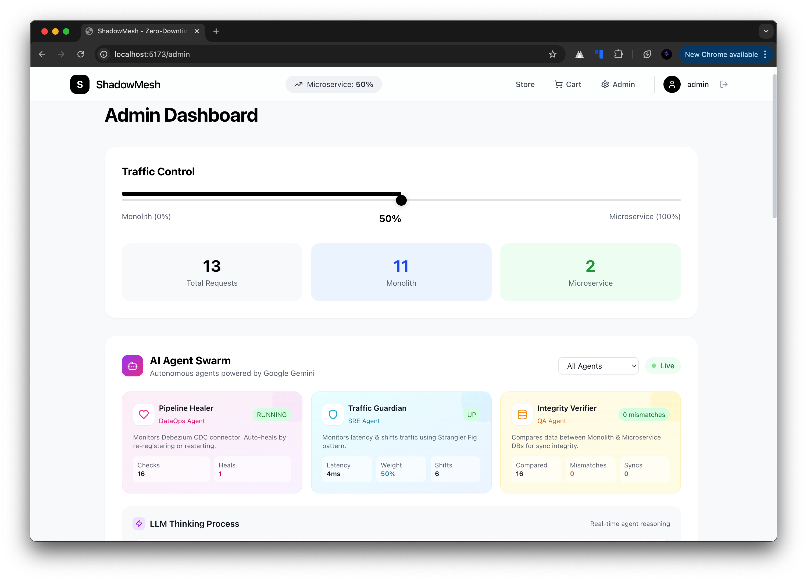
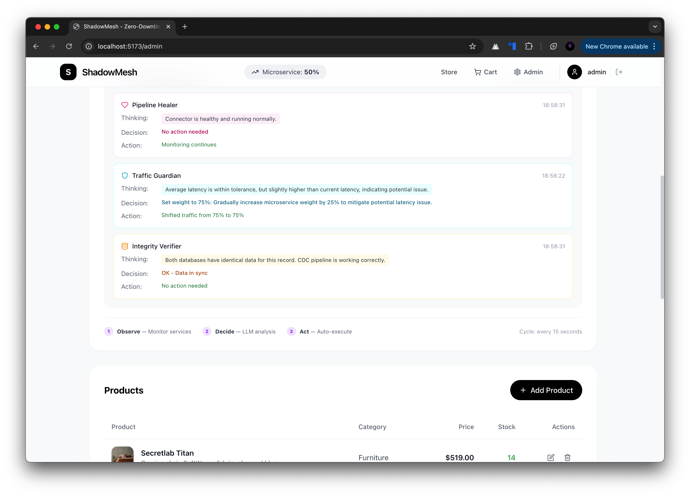
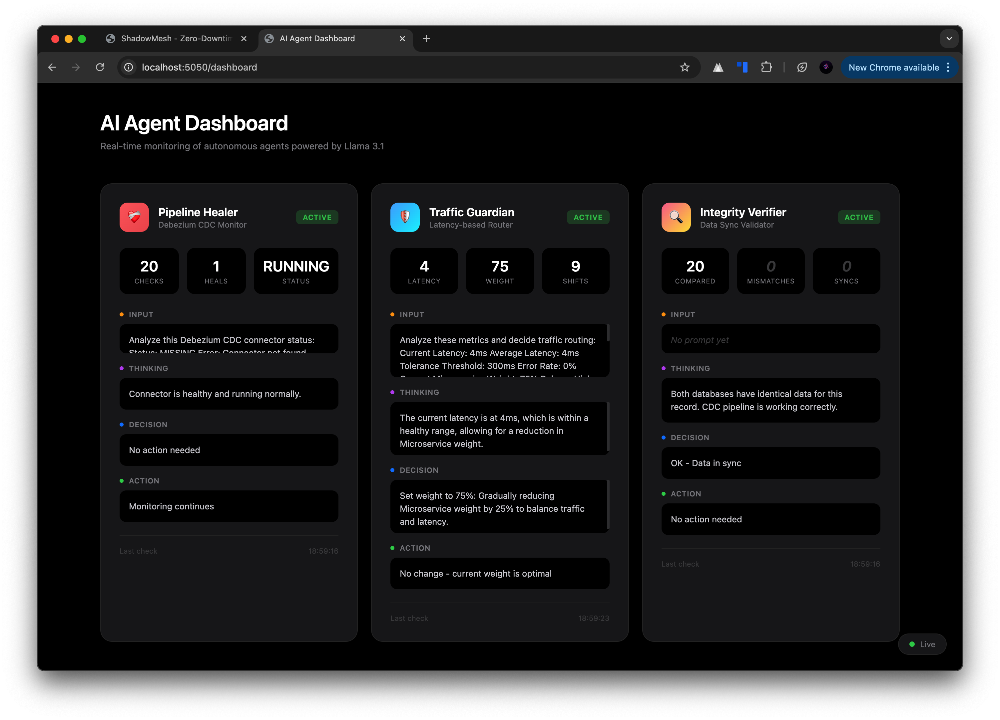

# ShadowMesh

Zero-downtime monolith-to-microservice migration platform using the Strangler Fig pattern.

## Overview

ShadowMesh demonstrates how to gradually migrate a legacy e-commerce monolith to microservices without downtime or data loss. It features real-time data synchronization via CDC, intelligent traffic routing, and autonomous LLM-powered agents that monitor system health and automatically adjust traffic distribution.

## Architecture

### System Architecture Overview

<p align="center">
  
</p>

---

### Main Website (E-commerce Platform)

#### Shopping Area
<p align="center">
  
</p>

#### Admin Dashboard
<p align="center">
  
</p>

<p align="center">
  
</p>

---

### AI Agent Dashboard (Autonomous Operations)

<p align="center">
  
</p>


## Tech Stack

| Layer | Technology |
|-------|------------|
| Frontend | React 18, Vite 5, Tailwind CSS |
| Gateway | Node.js 20, Express |
| Monolith | Node.js 20, Express, PostgreSQL 15 |
| Microservice | Python 3.11, Flask, PostgreSQL 15 |
| CDC | Debezium 2.4, Apache Kafka |
| AI Agents | Python 3.11, LangChain, Groq (Llama 3.1) |
| Infrastructure | Docker Compose |

## Quick Start

### Prerequisites

- Docker & Docker Compose
- Groq API key (free at [console.groq.com](https://console.groq.com))

### Setup

```bash
git clone https://github.com/yourusername/shadowmesh.git
cd shadowmesh

# Add your Groq API key
echo "GROQ_API_KEY=your_key_here" > .env

# Start all services
docker compose up -d --build

# Verify all 11 containers are running
docker compose ps
```

### Access Points

| Service | URL |
|---------|-----|
| Frontend | http://localhost:5173 |
| Gateway API | http://localhost:8080 |
| AI Agent Dashboard | http://localhost:5050/dashboard |
| Monolith API | http://localhost:3000 |
| Microservice API | http://localhost:5001 |
| Debezium | http://localhost:8083 |

### Test Credentials

| Role | Username | Password |
|------|----------|----------|
| Admin | admin | admin123 |
| User | john_doe | user123 |

## Features

### Traffic Management
The gateway routes requests between monolith and microservice based on a configurable weight (0-100%). Adjust via the admin dashboard or API.

### Change Data Capture
Real-time data synchronization from monolith to microservice:
```
PostgreSQL WAL → Debezium → Kafka → Consumer → Microservice DB
```

### AI Agent Swarm
Three autonomous agents powered by Groq's Llama 3.1:

- **Pipeline Healer** — Monitors CDC pipeline health, repairs broken connectors
- **Traffic Guardian** — Analyzes latency metrics, adjusts traffic distribution
- **Integrity Verifier** — Validates data consistency between databases

View real-time agent activity at http://localhost:5050/dashboard

## Testing the System

1. Login as admin at http://localhost:5173
2. Navigate to Admin Dashboard
3. Click "300ms (Critical)" to simulate monolith latency
4. Watch the AI Agent automatically shift traffic to microservice
5. Monitor agent decisions at http://localhost:5050/dashboard

## Development

```bash
# View logs
docker compose logs -f ai_agent

# Rebuild specific service
docker compose up -d --build gateway

# Access database
docker exec -it monolith_db psql -U postgres -d monolith_db

# Stop all services
docker compose down

# Stop and remove volumes
docker compose down -v
```

## Project Structure

```
shadowmesh/
├── frontend/          # React application
├── gateway/           # API gateway with traffic routing
├── monolith/          # Legacy Express application
├── microservice/      # Flask microservice
├── consumer/          # Kafka CDC consumer
├── ai_agent/          # LLM-powered monitoring agents
├── debezium/          # CDC connector configuration
├── docker-compose.yml # Container orchestration
└── init.sql           # Database initialization
```
